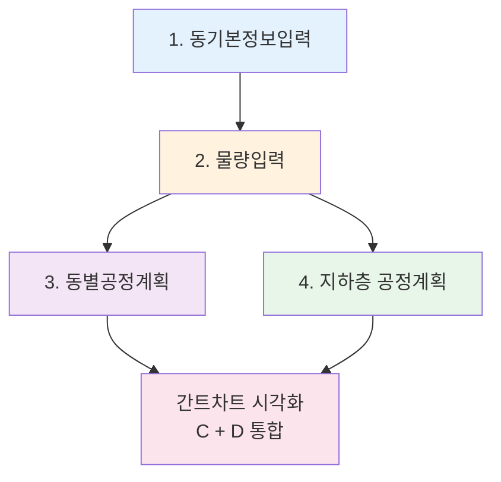
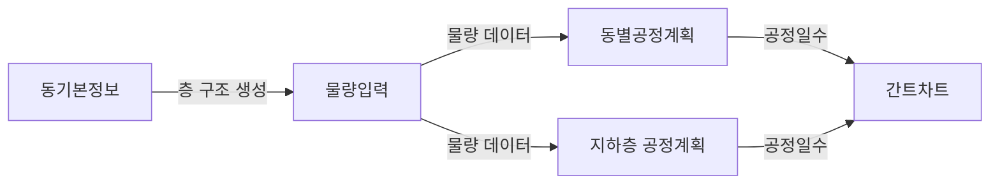
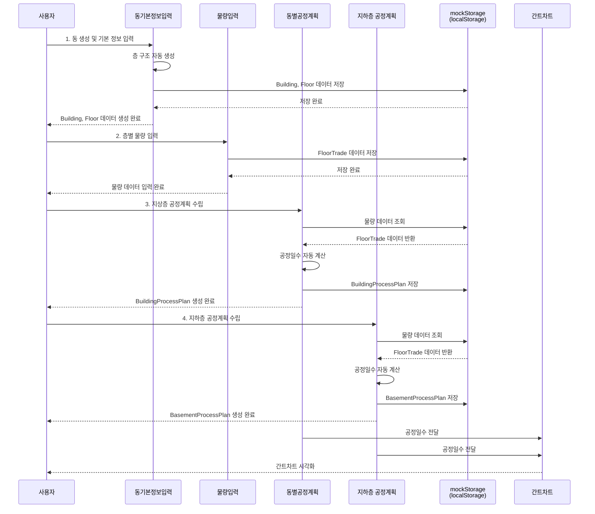
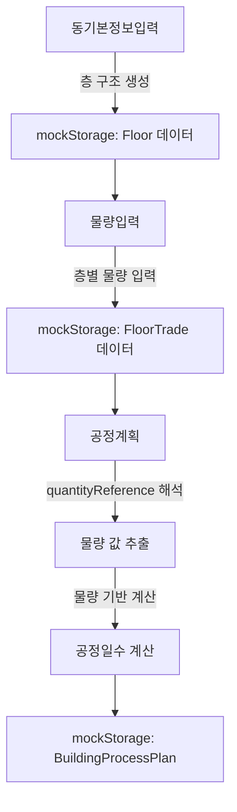
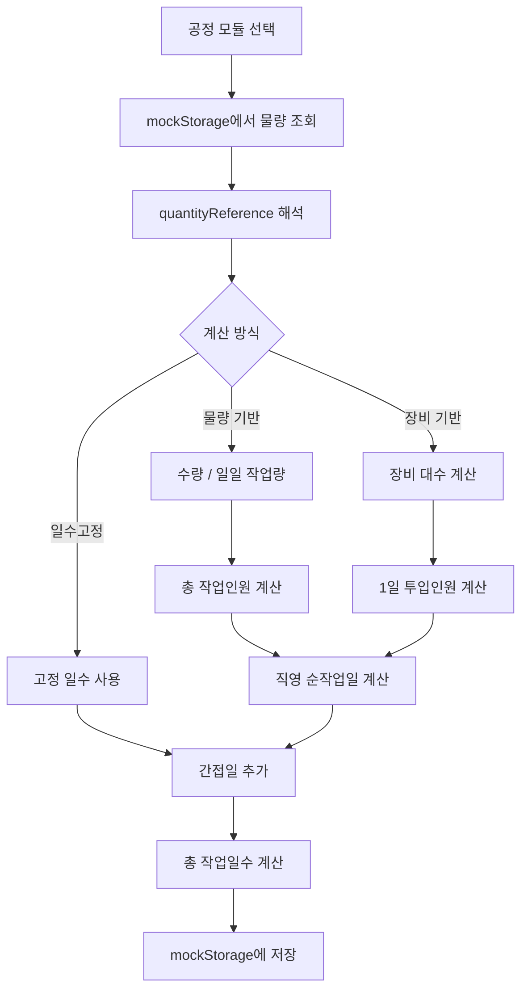

# 동기본정보·물량입력·공정계획 시스템 기획안

> **작성일**: 2025년 1월  
> **대상**: 개발 팀원  
> **목적**: 프로젝트에 실제 구현된 핵심 기능 4가지에 대한 구조와 흐름 설명

---

## 목차

1. [시스템 개요](#1-시스템-개요)
2. [동기본정보입력](#2-동기본정보입력)
3. [물량입력](#3-물량입력)
4. [동별공정계획](#4-동별공정계획)
5. [지하층 공정계획](#5-지하층-공정계획)
6. [데이터 흐름도](#6-데이터-흐름도)
7. [기술 스택 및 아키텍처](#7-기술-스택-및-아키텍처)
8. [구현 상태](#8-구현-상태)

---

## 1. 시스템 개요

### 1.1 전체 구조

ConTech-DX의 공정관리 시스템은 **4단계 프로세스**로 구성되어 있습니다:



### 1.2 각 단계의 역할

| 단계 | 컴포넌트 | 파일 경로 | 역할 | 출력 데이터 |
|------|---------|----------|------|------------|
| **1단계** | `BuildingBasicInfoPage` | `src/components/buildings/BuildingBasicInfoPage.tsx` | 동의 기본 정보 및 층 구조 설정 | Building, Floor 데이터 |
| **2단계** | `QuantityInputPage` | `src/components/buildings/QuantityInputPage.tsx` | 층별·공종별 물량 데이터 입력 | FloorTrade 데이터 |
| **3단계** | `BuildingProcessPlanPage` | `src/components/buildings/BuildingProcessPlanPage.tsx` | 지상층 공정계획 수립 및 일수 계산 | BuildingProcessPlan 데이터 |
| **4단계** | `BasementProcessPlanPage` | `src/components/buildings/BasementProcessPlanPage.tsx` | 지하층 공정계획 수립 (가설/흙막이/토공 포함) | BuildingProcessPlan 데이터 |

### 1.3 데이터 의존성



**핵심 원칙**: 각 단계는 이전 단계의 데이터를 기반으로 동작합니다.

---

## 2. 동기본정보입력

### 2.1 목적

동(건물)의 기본 정보를 입력하고, 층 구조를 자동 생성하여 이후 단계의 기반 데이터를 만듭니다.

### 2.2 주요 기능

#### 2.2.1 동 생성 및 관리

- **동 추가**: `BuildingForm` 컴포넌트를 통해 동 수를 입력하고 생성
- **동 복사**: 기존 동의 정보를 복사하여 새 동 생성 (103동 기준 또는 전동 공통 적용)
- **동 순서 변경**: `BuildingTabs`에서 드래그 앤 드롭으로 동 순서 조정
- **동 삭제**: 동 탭에서 삭제 기능 제공
- **동 이름 변경**: 동 탭에서 이름 수정 가능

#### 2.2.2 동 기본 정보 입력

**입력 항목** (`BuildingBasicInfo` 컴포넌트):
- 동 이름 (예: "103동")
- 동 번호 (자동 생성)
- 총 세대수
- 세대 타입 패턴 (UnitTypePattern 배열)
  - 코어별 세대 범위 (from, to)
  - 세대 타입 (예: "59A", "84A")
  - 코어 번호
- 코어 개수 및 타입 (CoreType: '중복도(판상형)' | '타워형' | '편복도')
- 슬라브 타입 (SlabType: '벽식구조' | 'RC구조' | '벽식구조(내부기둥)')

#### 2.2.3 층 구조 설정

**층수 정보** (`BuildingMeta.floorCount`):
- 지하층 수 (basement)
- 지상층 수 (ground 또는 coreGroundFloors 배열)
- 옥탑층 수 (ph 또는 corePhFloors 배열)
- 필로티 수 (pilotisCount 또는 corePilotisCounts 배열)
- 코어별 층수 설정 가능 (coreGroundFloors, coreBasementFloors, corePhFloors)

**층고 정보** (`BuildingMeta.heights`):
- 지하2층 층고 (basement2)
- 지하1층 층고 (basement1)
- 기준층 층고 (standard)
- 1층 층고 (floor1)
- 2층 층고 (floor2)
- 3층 층고 (floor3)
- 4층, 5층 층고 (floor4, floor5)
- 최상층 층고 (top)
- PH층 층고 (ph: number | number[])

#### 2.2.4 층 자동 생성

"층 생성" 버튼 클릭 시 (`BuildingBasicInfo` 컴포넌트):
1. 입력된 층수 정보를 기반으로 `Floor` 데이터 자동 생성
2. 각 층에 고유 ID 부여 (UUID)
3. 층 레이블 자동 생성 (예: "B2", "B1", "1F", "2F", ..., "PH1")
4. 층 분류 자동 설정 (FloorClass: '지하층' | '일반층' | '셋팅층' | '기준층' | '최상층' | '옥탑층')
5. 코어별 층 생성 지원 (예: "코어1-B2", "코어1-1F")
6. 층고 자동 적용

**생성 예시**:
```
B2 (지하층, floorNumber: -2, levelType: '지하')
B1 (지하층, floorNumber: -1, levelType: '지하')
1F (셋팅층, floorNumber: 1, levelType: '지상')
2F (일반층, floorNumber: 2, levelType: '지상')
...
15F (일반층, floorNumber: 15, levelType: '지상')
PH1 (옥탑층, floorNumber: 16, levelType: '지상')
```

#### 2.2.5 데이터 고정 기능

- **isBasicInfoLocked**: 동기본정보 데이터 고정 여부
- 고정 후에는 수정 불가 (데이터 무결성 보장)

### 2.3 데이터 구조

```typescript
// src/lib/types.ts

interface Building {
  id: string;
  projectId: string;
  buildingName: string;        // "103동"
  buildingNumber: number;      // 103
  meta: BuildingMeta;          // 기본 정보
  floors: Floor[];              // 층 목록
  floorTrades: FloorTrade[];   // 물량 데이터 (2단계에서 입력)
  createdAt?: string;
  updatedAt?: string;
}

interface BuildingMeta {
  totalUnits: number;
  unitTypePattern: UnitTypePattern[];
  coreCount: number;
  coreType: CoreType;
  slabType: SlabType;
  floorCount: {
    basement: number;
    ground: number;
    ph: number;
    coreGroundFloors?: number[];
    coreBasementFloors?: number[];
    corePhFloors?: number[];
    pilotisCount?: number;
    corePilotisCounts?: number[];
    corePilotisHeights?: number[];
    hasHighCeilingEquipmentRoom?: boolean;
  };
  heights: {
    basement2: number;
    basement1: number;
    standard: number;
    floor1: number;
    floor2: number;
    floor3: number;
    floor4?: number;
    floor5?: number;
    top: number;
    ph: number | number[];
  };
  standardFloorCycle?: number;
  pumpCarCount?: number | null;
  isBasicInfoLocked?: boolean;
  isDataInputLocked?: boolean;
}

interface Floor {
  id: string;
  buildingId: string;
  floorLabel: string;          // "B2", "B1", "1F", "2F", "PH1", "코어1-B2"
  floorNumber: number;         // -2, -1, 1, 2, ..., 16
  levelType: '지하' | '지상';
  floorClass: FloorClass;
  height: number | null;       // 층고(m)
}
```

### 2.4 사용자 시나리오

**시나리오 1: 새 동 추가**
1. `BuildingForm`에서 동 수 입력 (예: 3)
2. "동 탭 생성" 버튼 클릭
3. `handleCreateBuildings` 함수 실행
4. 101동, 102동, 103동 자동 생성
5. 각 동 탭에서 기본 정보 입력

**시나리오 2: 층 구조 생성**
1. 103동 탭 선택
2. `BuildingBasicInfo`에서 기본 정보 입력
3. 층수 정보 입력 (지하2층, 지상15층, PH1층)
4. 층고 정보 입력
5. "층 생성" 버튼 클릭
6. `BuildingBasicInfo`의 층 생성 로직 실행
7. B2, B1, 1F~15F, PH1 자동 생성 확인

**시나리오 3: 동 복사**
1. 103동 탭에서 "동 복사" 버튼 클릭
2. 복사할 동 수 입력 (예: 2)
3. `handleCopyBuilding` 함수 실행
4. 104동, 105동이 103동의 정보를 복사하여 생성
5. 층 설정도 함께 복사

### 2.5 구현 파일

- **메인 컴포넌트**: `src/components/buildings/BuildingBasicInfoPage.tsx`
- **하위 컴포넌트**: 
  - `BuildingBasicInfo.tsx` - 기본 정보 입력 폼
  - `FloorSettingsTable.tsx` - 층 설정 테이블
  - `BuildingTabs.tsx` - 동 탭 UI
  - `BuildingForm.tsx` - 동 생성 폼
- **서비스**: `src/lib/services/buildings.ts` - 데이터 CRUD
- **저장소**: `src/lib/services/mockStorage.ts` - localStorage 기반 저장

---

## 3. 물량입력

### 3.1 목적

각 동의 층별·공종별 물량 데이터를 입력합니다. 이 데이터는 공정계획에서 일수 계산의 기반이 됩니다.

### 3.2 주요 기능

#### 3.2.1 층별 공종 물량 입력

**입력 항목** (`FloorTradeTable` 컴포넌트):
- **갱폼** (gangForm.areaM2): 벽체 거푸집 면적
- **알폼** (alForm.areaM2): 보·슬라브 거푸집 면적
- **형틀** (formwork.areaM2): 전체 거푸집 면적 (유로폼 포함)
- **해체/정리** (stripClean.areaM2): 거푸집 해체 면적
- **철근** (rebar.ton): 철근 총 중량
  - rebar.wall: 벽 철근 (TON)
  - rebar.beamSlab: 보/슬라브 철근 (TON)
- **콘크리트** (concrete.volumeM3): 콘크리트 체적
  - concrete.wall: 벽 콘크리트 (M³)
  - concrete.beamSlab: 보/슬라브 콘크리트 (M³)

**특수층 처리**:
- **버림**: 형틀, 콘크리트만 입력 (tradeGroup: '버림')
- **기초**: 형틀, 해체/정리, 철근, 콘크리트 입력 (tradeGroup: '기초')
- **지하층**: 모든 항목 입력 (tradeGroup: '아파트')
- **지상층**: 모든 항목 입력 (tradeGroup: '아파트')
- **PH층**: 형틀, 해체/정리, 철근, 콘크리트 입력 (tradeGroup: '아파트')

#### 3.2.2 물량 데이터 구조

```typescript
// src/lib/types.ts

interface TradeData {
  gangForm?: {
    areaM2: number;
    productivity: number;
    workers: number;
    cost: number;
  };
  alForm?: {
    areaM2: number;
    productivity: number;
    workers: number;
    cost: number;
  };
  formwork?: {
    areaM2: number;
    productivity: number;
    workers: number;
    cost: number;
  };
  stripClean?: {
    areaM2: number;
    productivityM2: number;
    workers: number;
    cost: number;
  };
  rebar?: {
    ton: number;        // 합계용
    wall?: number;      // 벽 (TON)
    beamSlab?: number; // 보/슬라브 (TON)
    productivity: number;
    workers: number;
    cost: number;
  };
  concrete?: {
    volumeM3: number;   // 합계용
    wall?: number;      // 벽 (M³)
    beamSlab?: number; // 보/슬라브 (M³)
    equipmentCount: number;
    productivityM3: number;
    workers: number;
    cost: number;
  };
}

interface FloorTrade {
  id: string;
  floorId: string;
  buildingId: string;
  tradeGroup: string;  // '버림', '기초', '아파트' 등
  trades: TradeData;
}
```

#### 3.2.3 물량 참조 시스템

공정계획에서 물량을 참조할 때 사용하는 셀 참조 패턴 (`process-modules.ts`):

| 참조 패턴 | 설명 | 예시 |
|----------|------|------|
| `"D6"` | 직접 셀 참조 | 버림 형틀 = D6 (formwork.areaM2) |
| `"F7*0.45"` | 비율 계산 | 옹벽철근 = F7 × 45% (rebar.wall) |
| `"G9*0.6"` | 복합 계산 | 1차 타설 = G9 × 60% (concrete.volumeM3) |

**물량표 구조** (엑셀 기준):
```
행: 층별 (B2, B1, 1F, 2F, ...)
열: 공종별 
  - 갱폼 (gangForm.areaM2)
  - 알폼 (alForm.areaM2)
  - 형틀 (formwork.areaM2)
  - 해체/정리 (stripClean.areaM2)
  - 철근 (rebar.ton)
  - 콘크리트 (concrete.volumeM3)
```

### 3.3 사용자 시나리오

**시나리오 1: 기본 물량 입력**
1. "물량 입력" 페이지로 이동 (`QuantityInputPage`)
2. 103동 탭 선택
3. `FloorTradeTable`에서 "1F" 행 선택
4. 갱폼 651㎡, 알폼 796㎡ 입력
5. 철근 28.57ton, 콘크리트 209.36㎥ 입력
6. 자동 저장 (mockStorage → localStorage)

**시나리오 2: 버림 물량 입력**
1. "버림" 행 선택 (tradeGroup: '버림')
2. 형틀 40㎡ 입력 (formwork.areaM2)
3. 콘크리트 228.067㎥ 입력 (concrete.volumeM3)
4. 해체/정리는 자동으로 형틀과 동일하게 설정 가능

**시나리오 3: 지하층 물량 입력**
1. "B2" 행 선택 (tradeGroup: '아파트')
2. 형틀 4854.569㎡ 입력
3. 철근 118.014ton 입력
4. 콘크리트 782.352㎥ 입력

### 3.4 구현 파일

- **컴포넌트**: `src/components/buildings/QuantityInputPage.tsx`
- **하위 컴포넌트**: 
  - `FloorTradeTable.tsx` - 층별 공종 물량 입력 테이블
  - `DetailedFloorTradeTable.tsx` - 상세 물량 입력 테이블
- **서비스**: `src/lib/services/buildings.ts` - FloorTrade CRUD
- **저장소**: `src/lib/services/mockStorage.ts` - localStorage 기반 저장

---

## 4. 동별공정계획

### 4.1 목적

지상층(셋팅층, 기준층, 최상층, 옥탑층)의 공정계획을 수립하고, 물량 데이터를 기반으로 자동으로 공정일수를 계산합니다.

### 4.2 주요 기능

#### 4.2.1 공정 구분

**6가지 공정 구분** (`ProcessCategory`):
1. **버림**: 버림 콘크리트 타설 (1~2일)
2. **기초**: 기초 공사 (7~10일)
3. **지하층**: 지하 골조 (별도 페이지에서 관리)
4. **셋팅층**: 1~5층 저층부 (표준공정)
5. **기준층**: 반복되는 중간층 (5~8일 사이클 선택)
6. **옥탑층**: 최상층 및 PH층 (표준공정)

#### 4.2.2 공정 타입 선택

**표준공정**: 고정된 일수로 진행 (예: 셋팅층 6일, 옥탑층 5일)

**사이클 공정** (기준층만):
- **5일 사이클**: 순작업일 3일 + 양생 2일
- **6일 사이클**: 순작업일 4일 + 양생 2일
- **7일 사이클**: 순작업일 5일 + 양생 2일
- **8일 사이클**: 순작업일 6일 + 양생 2일

**특수 공정 타입**:
- **지하외벽 합벽 적용**: 지하층 외벽 합벽 타설
- **일체타설 적용**: 일체 타설 방식

#### 4.2.3 자동 일수 계산

**계산 방식** (`process-modules.ts`의 `ProcessItem` 기반):

1. **일수고정 방식**:
   ```typescript
   directWorkDays = processItem.directWorkDays!; // 고정값
   totalDays = ROUNDUP(directWorkDays + indirectDays, 0);
   ```

2. **물량 기반 계산**:
   ```typescript
   // quantityReference 해석 (예: "D6", "F7*0.45")
   quantity = parseQuantityReference(quantityReference, floorTrade);
   
   // 총 작업인원 계산
   totalWorkers = ROUNDUP(quantity / dailyProductivity, 0);
   
   // 직영 순작업일 계산
   directWorkDays = calculateDirectWorkDays(quantity, dailyProductivity, totalWorkers);
   ```

3. **장비 기반 계산** (콘크리트 타설):
   ```typescript
   // 장비 대수 계산
   equipmentCount = CEILING(MIN(2, quantity / equipmentCalculationBase), 1);
   
   // 1일 투입인원
   dailyWorkers = equipmentCount * equipmentWorkersPerUnit; // 4, 5, 6명
   
   // 직영 순작업일 계산
   directWorkDays = MAX(1, IF(소수점 < 0.5, ROUNDDOWN, ROUNDUP));
   ```

#### 4.2.4 공정 모듈 시스템

각 공정 구분은 **공정 모듈(ProcessModule)**로 정의되어 있습니다 (`src/lib/data/process-modules.ts`):

```typescript
interface ProcessModule {
  id: string;                    // 'foundation-standard', 'standard-8day' 등
  name: ProcessType;              // '표준공정', '8일 사이클'
  category: ProcessCategory;     // '기초', '기준층' 등
  items: ProcessItem[];           // 세부공정 항목 목록
}

interface ProcessItem {
  id: string;
  workItem: string;              // '1.먹매김', '2.갱폼설치' 등
  unit: string;                  // '㎡', 'ton', '㎥'
  quantityReference?: string;     // 'D6', 'F7*0.45' 등
  dailyProductivity: number;     // 인당 1일 작업량
  calculationBasis?: string;     // '일수고정', '장비대수*5명'
  equipmentName?: string;        // '콘크리트 펌프차'
  equipmentCount: number;        // 장비대수 (고정값 또는 계산식)
  directWorkDays?: number;       // 직영 순작업일 (고정값인 경우)
  indirectDays: number;          // 간접일 (양생, 검측)
  indirectWorkItem?: string;     // '양생', '검측' 등
  equipmentCalculationBase?: number; // 대당 타설량 (예: 650)
  equipmentWorkersPerUnit?: number;  // 장비당 인원수 (4, 5, 6)
  floorLabel?: string;           // 층별 구분
}
```

**예시: 기초 표준공정 모듈**
```typescript
{
  id: 'foundation-standard',
  name: '표준공정',
  category: '기초',
  items: [
    {
      id: 'foundation-meokmaekim',
      workItem: '3.먹매김',
      calculationBasis: '일수고정',
      directWorkDays: 1,  // 고정 1일
      indirectDays: 0,
    },
    {
      id: 'foundation-rebar',
      workItem: '4.기초철근조립',
      unit: 'ton',
      quantityReference: 'F7',  // FloorTrade의 rebar.ton 참조
      dailyProductivity: 1.1,
      calculationBasis: '일수고정',
      directWorkDays: 6,  // 고정 6일
      indirectDays: 0.5,
      indirectWorkItem: '검측',
    },
    // ...
  ],
}
```

#### 4.2.5 층별 공정계획 표시

**행 구조**:
- 공정 구분 행 (버림, 기초, 셋팅층, 기준층, 최상층, 옥탑층)
- 층별 행 (1F, 2F, 3F, ..., PH1)
- 합계 행

**열 구조**:
- 공정 구분별로 열 분리 (버림 열, 기초 열, 셋팅층 열, ...)
- 각 열에 세부공정 항목 표시
- 공정 타입 선택 드롭다운 (표준공정, 5~8일 사이클)
- 계산된 일수 표시 (직영 순작업일, 간접일, 총 작업일수)

#### 4.2.6 순작업일 오버라이드

- `itemDirectWorkDaysOverrides`: 세부공정 항목별 순작업일 수동 조정 가능
- 키 형식: `"category-floorLabel-itemId"` (예: "기준층-4F-standard-rebar")
- 값: 수동 입력한 순작업일

### 4.3 데이터 구조

```typescript
// src/lib/types.ts

interface BuildingProcessPlan {
  id: string;
  buildingId: string;
  projectId: string;
  processes: {
    [category in ProcessCategory]?: {
      days: number;              // 공정일수 (간트차트 duration)
      processType: ProcessType;   // 선택된 공정 타입
      floors?: {                 // 층별 공정 타입 (지하층, 옥탑층 등)
        [floorLabel: string]: { 
          processType: ProcessType 
        } 
      };
    };
  };
  totalDays: number;            // 구분공정 합계일수
  itemDirectWorkDaysOverrides?: { // 순작업일 오버라이드
    [key: string]: number;        // "category-floorLabel-itemId": 순작업일
  };
  createdAt?: string;
  updatedAt?: string;
}
```

### 4.4 사용자 시나리오

**시나리오 1: 기본 공정계획 수립**
1. "동별공정계획" 페이지로 이동 (`BuildingProcessPlanPage`)
2. 103동 탭 선택
3. "기초" 공정 구분에서 "표준공정" 선택
4. 자동으로 일수 계산 (먹매김 1일, 철근조립 6일, ...)
5. 계산 결과 확인

**시나리오 2: 기준층 사이클 선택**
1. "기준층" 공정 구분 선택
2. "8일 사이클" 선택
3. 각 층(4F~14F)에 8일 사이클 적용
4. 자동으로 일수 계산

**시나리오 3: 수동 일수 조정**
1. 계산된 일수가 부적절한 경우
2. 해당 항목의 "직영 순작업일" 수동 입력
3. `itemDirectWorkDaysOverrides`에 저장
4. 총 작업일수 자동 재계산

### 4.5 구현 파일

- **컴포넌트**: `src/components/buildings/BuildingProcessPlanPage.tsx`
- **데이터**: `src/lib/data/process-modules.ts` - 공정 모듈 정의
- **서비스**: `src/lib/services/buildings.ts` - BuildingProcessPlan CRUD
- **저장소**: `src/lib/services/mockStorage.ts` - localStorage 기반 저장

---

## 5. 지하층 공정계획

### 5.1 목적

지하층 공정계획을 별도로 관리하며, 가설공사·흙막이·토공사 일수를 포함하여 CP(중요 경로) 타설구간을 계산합니다.

### 5.2 주요 기능

#### 5.2.1 공정 구분

**3가지 공정 구분** (지하층 공정계획 전용):
1. **버림**: 버림 콘크리트 타설
2. **기초**: 기초 공사
3. **지하층**: 지하 골조 (B2, B1)

**동별공정계획과의 차이점**:
- 셋팅층, 기준층, 옥탑층은 포함하지 않음
- 지하층만 별도 관리

#### 5.2.2 가설·흙막이·토공사 일수 입력

**입력 항목** (동별):
- **가설공사 일수** (`temporaryWorkDays`): 현장 사무소, 안전 시설물 설치 일수
- **흙막이 일수** (`earthRetentionWorkDays`): 흙막이 벽 시공 일수
- **토공사 일수** (`earthworkWorkDays`): 지하 굴착 일수

**용도**: CP 타설구간 계산에 사용 (향후 구현)

#### 5.2.3 특수 행 물량 입력

**주차장 및 3단 가시설 적용부 수량** (`specialRowQuantities`):
- 키 형식: `"floorLabel-specialType"` (예: "B1-parking", "B1-facility3")
- 값: 각 공종별 물량 (gangForm, alForm, formwork, stripClean, rebar, concrete)
- 지하층별로 주차장, 3단 가시설 등 특수 구간 물량 입력 가능

#### 5.2.4 CP 타설구간 계산

**CP(Critical Path) 타설구간** (향후 구현):
가설공사 + 흙막이 + 토공사 + 버림 + 기초 + 주동지하B2 + 주동지하B1까지의 공사일수가 **가장 긴 구간**을 CP로 설정합니다.

**계산 로직** (향후):
```
CP 타설구간 = MAX(
  가설공사일수 + 흙막이일수 + 토공사일수 + 버림일수 + 기초일수 + B2일수 + B1일수
)
```

### 5.3 데이터 구조

```typescript
// src/lib/types.ts

interface BuildingProcessPlan {
  // ... (동별공정계획과 동일)
  
  // 가설·흙막이·토공사 일수 (지하층 공정계획 전용)
  temporaryWorkDays?: number;      // 가설공사 일수
  earthRetentionWorkDays?: number; // 흙막이 일수
  earthworkWorkDays?: number;      // 토공사 일수
  
  // 주차장 및 3단 가시설 적용부 수량
  specialRowQuantities?: {
    [key: string]: {                // "floorLabel-specialType"
      gangForm?: number;
      alForm?: number;
      formwork?: number;
      stripClean?: number;
      rebar?: number;
      concrete?: number;
    };
  };
}
```

### 5.4 사용자 시나리오

**시나리오 1: 기본 지하층 공정계획 수립**
1. "지하층 공정계획" 페이지로 이동 (`BasementProcessPlanPage`)
2. 103동 탭 선택
3. 가설공사 10일, 흙막이 20일, 토공사 15일 입력
4. "버림" 공정에서 "표준공정" 선택
5. "기초" 공정에서 "표준공정" 선택
6. "지하층" 공정에서 "표준공정" 선택
7. B2, B1 일수 자동 계산

**시나리오 2: 특수 행 물량 입력**
1. "B1-주차장" 행 추가
2. 주차장 구간의 물량 입력 (형틀, 철근, 콘크리트 등)
3. `specialRowQuantities`에 저장
4. 해당 구간의 공정일수 계산

### 5.5 구현 파일

- **컴포넌트**: `src/components/buildings/BasementProcessPlanPage.tsx`
- **데이터**: `src/lib/data/process-modules.ts` - 지하층 공정 모듈 정의
- **서비스**: `src/lib/services/buildings.ts` - BuildingProcessPlan CRUD
- **저장소**: `src/lib/services/mockStorage.ts` - localStorage 기반 저장

---

## 6. 데이터 흐름도

### 6.1 전체 데이터 흐름



### 6.2 물량 참조 흐름



**물량 참조 예시**:
```
공정 모듈: foundation-rebar
quantityReference: "F7"
→ mockStorage에서 floorId가 "B2"인 FloorTrade의 trades.rebar.ton 값 조회
→ 예: 110.624ton
→ 일수 계산: ROUNDUP(110.624 / 1.1, 0) = 101명일
→ 직영 순작업일: 6일 (고정값)
→ 총 작업일수: ROUNDUP(6 + 0.5, 0) = 7일
```

### 6.3 공정일수 계산 흐름



---

## 7. 기술 스택 및 아키텍처

### 7.1 기술 스택

| 분류 | 기술 | 버전 | 용도 |
|------|------|------|------|
| **프레임워크** | Next.js | 16.0.10 | React 기반 풀스택 프레임워크 (App Router) |
| **언어** | TypeScript | 5.x | 타입 안정성 보장 |
| **UI 라이브러리** | React | 19.2.0 | 컴포넌트 기반 UI |
| **스타일링** | Tailwind CSS | 4.x | 유틸리티 기반 CSS |
| **UI 컴포넌트** | Radix UI | Latest | 접근성 있는 컴포넌트 |
| **애니메이션** | Framer Motion | 12.x | 부드러운 UI 전환 |
| **상태 관리** | React Hooks | - | useState, useMemo, useCallback |
| **데이터 저장** | mockStorage | - | localStorage 기반 (Supabase 마이그레이션 준비) |
| **폼 처리** | React Hook Form | 7.x | 폼 상태 관리 |
| **유효성 검증** | Zod | 4.x | 스키마 검증 |
| **날짜 처리** | date-fns | 4.x | 날짜 포맷팅 및 계산 |
| **알림** | Sonner | 2.x | 토스트 알림 |
| **차트** | Recharts | 3.x | 데이터 시각화 |

### 7.2 아키텍처 패턴

#### 7.2.1 컴포넌트 구조
```
src/components/buildings/
├── BuildingBasicInfoPage.tsx      # 동기본정보입력 페이지
├── QuantityInputPage.tsx          # 물량입력 페이지
├── BuildingProcessPlanPage.tsx   # 동별공정계획 페이지
├── BasementProcessPlanPage.tsx   # 지하층 공정계획 페이지
├── BuildingBasicInfo.tsx          # 기본 정보 입력 폼
├── FloorSettingsTable.tsx        # 층 설정 테이블
├── FloorTradeTable.tsx           # 물량 입력 테이블
├── DetailedFloorTradeTable.tsx   # 상세 물량 입력 테이블
├── BuildingTabs.tsx              # 동 탭 UI
└── BuildingForm.tsx              # 동 생성 폼
```

#### 7.2.2 데이터 레이어
```
src/lib/
├── types.ts                      # 타입 정의
├── services/
│   ├── buildings.ts              # Building 관련 API 호출
│   └── mockStorage.ts            # localStorage 기반 저장소
├── data/
│   └── process-modules.ts        # 공정 모듈 데이터
└── utils/
    ├── logger.ts                 # 로깅 유틸리티
    └── cache.ts                  # TTL 기반 캐싱
```

#### 7.2.3 데이터 흐름
```
사용자 입력
  ↓
컴포넌트 (UI)
  ↓
서비스 레이어 (buildings.ts)
  ↓
mockStorage (localStorage)
  ↓
상태 업데이트
  ↓
UI 리렌더링
```

### 7.3 주요 설계 원칙

#### 7.3.1 단방향 데이터 흐름
- 부모 컴포넌트에서 자식 컴포넌트로 props 전달
- 자식 컴포넌트는 콜백 함수로 부모에 변경 사항 전달

#### 7.3.2 컴포넌트 재사용
- `BuildingTabs` 컴포넌트를 여러 페이지에서 공통 사용
- 공정계획 테이블 로직을 재사용 가능한 훅으로 분리

#### 7.3.3 타입 안정성
- 모든 데이터 구조를 TypeScript 인터페이스로 정의
- 컴파일 타임에 타입 오류 검출

#### 7.3.4 데이터 저장 전략
- 현재: `mockStorage`를 통한 localStorage 저장
- 향후: Supabase 마이그레이션 준비 (코드 구조 유지)

---

## 8. 구현 상태

### 8.1 완료된 기능

#### 8.1.1 동기본정보입력
- ✅ 동 생성 및 관리 (추가, 복사, 삭제, 순서 변경)
- ✅ 동 기본 정보 입력 (세대수, 코어, 슬라브 타입 등)
- ✅ 층 구조 설정 (층수, 층고)
- ✅ 층 자동 생성 (코어별 층 생성 지원)
- ✅ 데이터 고정 기능 (isBasicInfoLocked)
- ✅ 동 복사 기능 (103동 기준 또는 전동 공통 적용)

#### 8.1.2 물량입력
- ✅ 층별 공종 물량 입력 (갱폼, 알폼, 형틀, 해체/정리, 철근, 콘크리트)
- ✅ 특수층 처리 (버림, 기초, 지하층, PH층)
- ✅ 철근/콘크리트 세분화 (벽, 보/슬라브)
- ✅ 자동 저장 (localStorage)
- ✅ 상세 물량 입력 테이블 (DetailedFloorTradeTable)

#### 8.1.3 동별공정계획
- ✅ 6가지 공정 구분 지원 (버림, 기초, 지하층, 셋팅층, 기준층, 옥탑층)
- ✅ 공정 타입 선택 (표준공정, 5~8일 사이클)
- ✅ 자동 일수 계산 (일수고정, 물량기반, 장비기반)
- ✅ 공정 모듈 시스템 (process-modules.ts)
- ✅ 순작업일 오버라이드 기능
- ✅ 층별 공정 타입 설정

#### 8.1.4 지하층 공정계획
- ✅ 3가지 공정 구분 지원 (버림, 기초, 지하층)
- ✅ 가설·흙막이·토공사 일수 입력
- ✅ 특수 행 물량 입력 (주차장, 3단 가시설)
- ✅ 자동 일수 계산

### 8.2 진행 중인 기능

- 🔄 간트차트 통합 (iframe으로 외부 라이브러리 사용 중)
- 🔄 CP 타설구간 계산 (로직 준비 중)

### 8.3 향후 계획

- ⏳ Supabase 마이그레이션 (mockStorage → Supabase)
- ⏳ 실시간 다중 사용자 협업
- ⏳ 타설구간별 세분화 (주동지하, 지하주차장, 6.5m 이상 층고)
- ⏳ 공정일수 최적화 AI
- ⏳ 모바일 앱 지원

### 8.4 데이터 저장 방식

**현재 구현**:
- `mockStorage.ts`를 통한 localStorage 저장
- 브라우저 환경: localStorage 사용
- Node.js 환경: 파일 시스템 사용 (public/mock.json)

**저장 키**:
- `contech_buildings`: Building 데이터
- `contech_floors`: Floor 데이터
- `contech_floor_trades`: FloorTrade 데이터

**향후 계획**:
- Supabase PostgreSQL로 마이그레이션
- 현재 코드 구조는 Supabase 연동 시 최소한의 수정으로 전환 가능

---

## 9. 주요 파일 구조

### 9.1 컴포넌트 파일

```
src/components/buildings/
├── BuildingBasicInfoPage.tsx      # 동기본정보입력 메인 페이지
├── BuildingBasicInfo.tsx          # 기본 정보 입력 폼
├── FloorSettingsTable.tsx        # 층 설정 테이블
├── BuildingForm.tsx              # 동 생성 폼
├── BuildingTabs.tsx              # 동 탭 UI
├── QuantityInputPage.tsx         # 물량입력 메인 페이지
├── FloorTradeTable.tsx           # 물량 입력 테이블
├── DetailedFloorTradeTable.tsx   # 상세 물량 입력 테이블
├── BuildingProcessPlanPage.tsx   # 동별공정계획 메인 페이지
├── BasementProcessPlanPage.tsx   # 지하층 공정계획 메인 페이지
└── index.ts                      # 배럴 익스포트
```

### 9.2 서비스 파일

```
src/lib/services/
├── buildings.ts                  # Building, Floor, FloorTrade CRUD
└── mockStorage.ts               # localStorage 기반 저장소
```

### 9.3 데이터 파일

```
src/lib/data/
└── process-modules.ts            # 공정 모듈 정의 (PROCESS_MODULES)
```

### 9.4 타입 정의

```
src/lib/types.ts
├── Building
├── BuildingMeta
├── Floor
├── FloorTrade
├── TradeData
├── BuildingProcessPlan
├── ProcessCategory
├── ProcessType
└── ProcessModule (process-modules.ts에서 import)
```

---

## 10. 개발 가이드

### 10.1 새 동 추가 기능 개발 시

#### 10.1.1 체크리스트
- [ ] 동 번호 자동 생성 로직 확인 (`getNextBuildingNumber`)
- [ ] 동 이름 중복 체크
- [ ] 기본 메타데이터 설정 (103동 기준 또는 전동 공통)
- [ ] mockStorage 저장 확인
- [ ] 에러 처리 및 사용자 피드백

#### 10.1.2 주요 함수
```typescript
// BuildingBasicInfoPage.tsx
const handleCreateBuildings = async (count: number) => {
  // 1. 다음 동 번호 계산
  const nextNumber = getNextBuildingNumber(buildings);
  
  // 2. 동 생성 (mockStorage)
  const newBuilding = await createBuilding({
    projectId,
    buildingName: `${nextNumber}동`,
    buildingNumber: nextNumber,
    meta: defaultMeta,
  });
  
  // 3. 상태 업데이트
  setBuildings([...buildings, newBuilding]);
};
```

### 10.2 물량 입력 기능 개발 시

#### 10.2.1 체크리스트
- [ ] FloorTrade 데이터 구조 확인
- [ ] 층별 물량 입력 필드 검증
- [ ] mockStorage 자동 저장 로직 확인
- [ ] 물량 참조 패턴 해석 로직
- [ ] 낙관적 업데이트 처리

#### 10.2.2 주요 함수
```typescript
// FloorTradeTable.tsx
const handleUpdateQuantity = async (
  floorId: string,
  tradeType: string,
  value: number
) => {
  // 1. FloorTrade 찾기 또는 생성
  const floorTrade = await findOrCreateFloorTrade(floorId);
  
  // 2. 물량 업데이트
  floorTrade.trades[tradeType] = value;
  
  // 3. mockStorage에 저장
  await updateFloorTrade(floorTrade);
};
```

### 10.3 공정일수 계산 기능 개발 시

#### 10.3.1 체크리스트
- [ ] 공정 모듈 선택 확인
- [ ] mockStorage에서 물량 데이터 조회
- [ ] 물량 참조 해석 로직 (`quantityReference`)
- [ ] 계산 방식별 분기 처리 (일수고정/물량기반/장비기반)
- [ ] 간접일 추가 로직
- [ ] 계산 결과 mockStorage 저장

#### 10.3.2 주요 함수
```typescript
// BuildingProcessPlanPage.tsx
const calculateProcessDays = (
  processItem: ProcessItem,
  floorTrade: FloorTrade
): ProcessItemDays => {
  // 1. 물량 참조 해석
  const quantity = parseQuantityReference(
    processItem.quantityReference,
    floorTrade
  );
  
  // 2. 계산 방식 확인
  if (processItem.calculationBasis === '일수고정') {
    return {
      directWorkDays: processItem.directWorkDays!,
      indirectDays: processItem.indirectDays,
      totalDays: ROUNDUP(
        processItem.directWorkDays! + processItem.indirectDays,
        0
      ),
    };
  }
  
  // 3. 물량 기반 계산
  // ...
};
```

### 10.4 디버깅 팁

#### 10.4.1 localStorage 확인
- 브라우저 개발자 도구 → Application → Local Storage
- `contech_buildings`, `contech_floors`, `contech_floor_trades` 키 확인

#### 10.4.2 물량 참조 오류
- `quantityReference` 패턴이 올바른지 확인
- mockStorage에서 FloorTrade 데이터 조회 확인
- 콘솔에서 물량 값 추출 과정 로그 확인

#### 10.4.3 공정일수 계산 오류
- 공정 모듈이 올바르게 선택되었는지 확인
- 계산 방식(일수고정/물량기반/장비기반) 확인
- 중간 계산 값(총 작업인원, 장비 대수 등) 로그 확인

#### 10.4.4 데이터 동기화 문제
- localStorage에 데이터가 올바르게 저장되었는지 확인
- 컴포넌트 마운트 시 데이터 로드 확인
- 상태 업데이트 후 리렌더링 확인

---

## 11. FAQ 및 주의사항

### 11.1 자주 묻는 질문

#### Q1: 동을 생성했는데 층이 생성되지 않아요.
**A**: 동기본정보입력 페이지에서 기본 정보(층수, 층고)를 입력한 후 "층 생성" 버튼을 클릭해야 합니다.

#### Q2: 물량을 입력했는데 공정일수가 계산되지 않아요.
**A**: 다음을 확인해주세요:
1. 물량 입력이 올바른지 확인
2. 공정 모듈이 선택되었는지 확인
3. 물량 참조 패턴(`quantityReference`)이 올바른지 확인
4. localStorage에 데이터가 저장되었는지 확인

#### Q3: 기준층 사이클을 변경했는데 일수가 업데이트되지 않아요.
**A**: 사이클 변경 후 자동으로 재계산됩니다. 만약 업데이트되지 않는다면:
1. 페이지를 새로고침해주세요
2. localStorage에서 직접 확인해주세요
3. 브라우저 콘솔에서 에러 메시지 확인

#### Q4: 동을 복사했는데 물량 데이터가 복사되지 않아요.
**A**: 현재 동 복사 기능은 기본 정보와 층 구조만 복사합니다. 물량 데이터는 별도로 입력해야 합니다.

#### Q5: localStorage 데이터가 사라졌어요.
**A**: 다음을 확인해주세요:
1. 브라우저 캐시 삭제 여부
2. 시크릿 모드 사용 여부
3. 다른 브라우저에서 확인
4. localStorage 용량 제한 (5~10MB)

### 11.2 주의사항

#### 11.2.1 데이터 고정 기능
- 동기본정보를 고정하면 이후 수정이 불가능합니다.
- 물량 입력 전에 기본 정보를 최종 확인하고 고정하세요.

#### 11.2.2 물량 참조 패턴
- `quantityReference`는 엑셀의 셀 참조 패턴을 따릅니다.
- 예: `"D6"` = D열 6행 (formwork.areaM2), `"F7*0.45"` = F7 값 × 0.45
- 잘못된 패턴은 계산 오류를 발생시킬 수 있습니다.

#### 11.2.3 공정 모듈 선택
- 각 공정 구분마다 적절한 공정 타입을 선택해야 합니다.
- 기준층은 사이클(5~8일)을 선택할 수 있지만, 다른 구분은 표준공정만 가능합니다.

#### 11.2.4 localStorage 용량 제한
- 대규모 프로젝트(100동 이상)에서는 localStorage 용량 제한에 주의하세요.
- 향후 Supabase 마이그레이션으로 해결 예정입니다.

#### 11.2.5 브라우저 호환성
- localStorage는 모든 모던 브라우저에서 지원됩니다.
- Internet Explorer는 지원하지 않습니다.

### 11.3 알려진 이슈

#### 11.3.1 데이터 손실 방지
- 자동 저장 기능이 있지만, 중요한 데이터는 수동으로 백업하는 것을 권장합니다.
- 브라우저 캐시를 삭제하면 localStorage 데이터도 삭제될 수 있습니다.

#### 11.3.2 성능 이슈
- 대량의 층(50층 이상)이 있는 경우 렌더링이 느려질 수 있습니다.
- `useMemo`를 사용하여 불필요한 재계산을 방지했습니다.

#### 11.3.3 다중 브라우저 동기화
- localStorage는 브라우저별로 독립적입니다.
- 같은 계정이라도 다른 브라우저에서는 데이터가 동기화되지 않습니다.
- 향후 Supabase 마이그레이션으로 해결 예정입니다.

---

## 12. 참고 자료

### 12.1 코드 참조
- `src/lib/data/process-modules.ts` - 공정 모듈 정의
- `src/lib/types.ts` - 타입 정의
- `src/lib/services/buildings.ts` - API 서비스
- `src/lib/services/mockStorage.ts` - localStorage 저장소

### 12.2 외부 문서
- [Next.js 공식 문서](https://nextjs.org/docs)
- [React 공식 문서](https://react.dev)
- [TypeScript 공식 문서](https://www.typescriptlang.org/docs)
- [Tailwind CSS 공식 문서](https://tailwindcss.com/docs)

---

## 13. 변경 이력

| 날짜 | 버전 | 변경 내용 | 작성자 |
|------|------|----------|--------|
| 2025-01 | 1.0.0 | 초기 기획안 작성 | - |
| 2025-01 | 2.0.0 | 실제 구현 상태 기반으로 재작성 | - |

---

**문서 끝**
